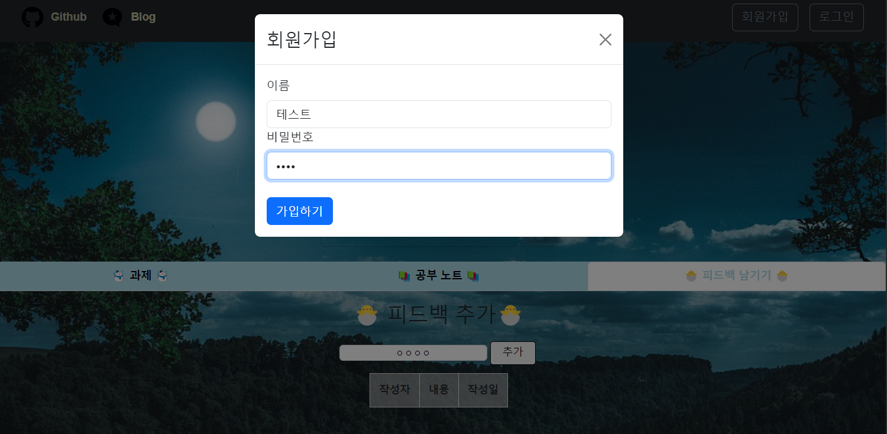
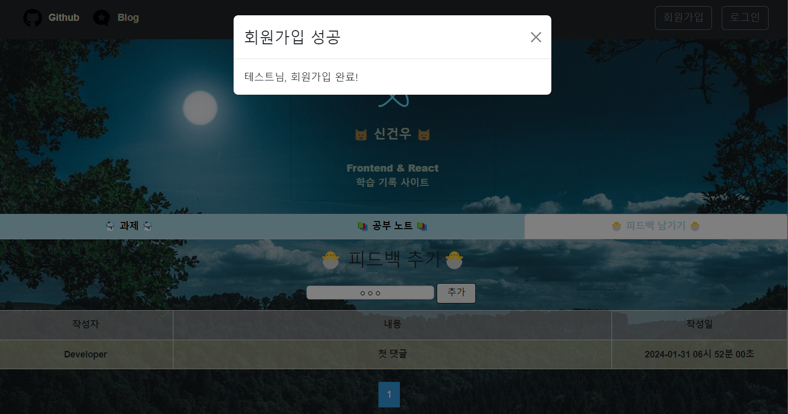
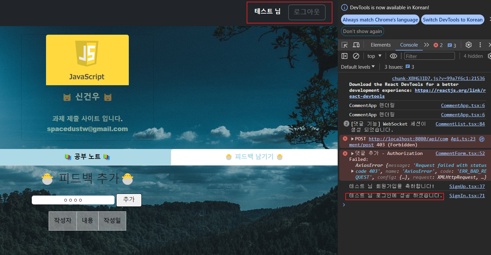
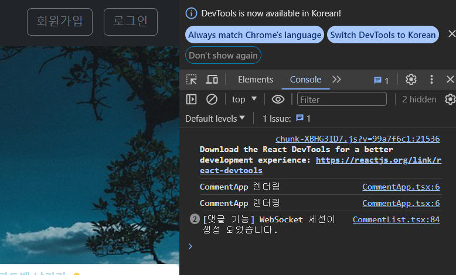
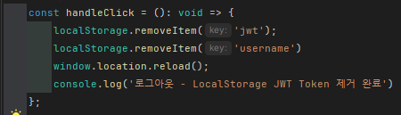
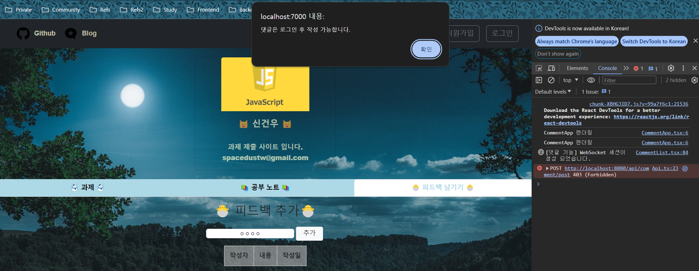
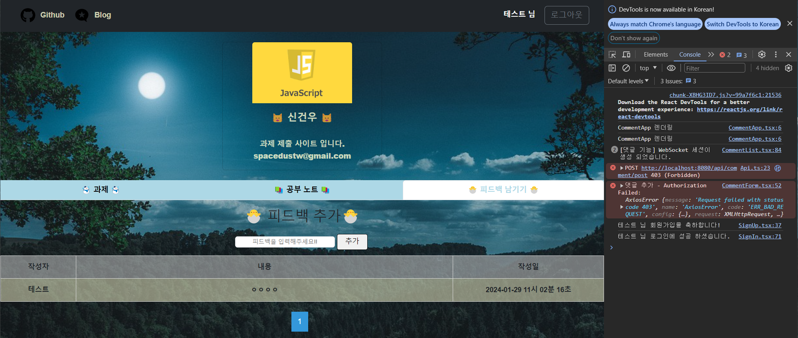
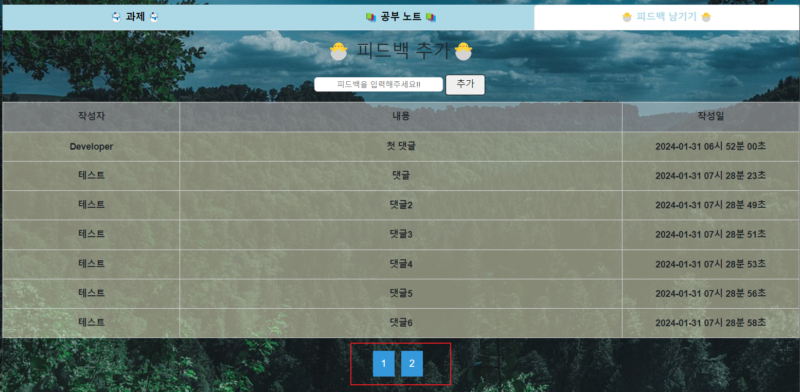
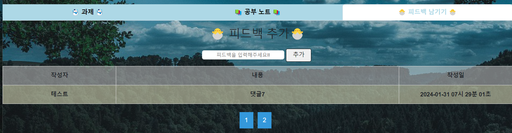

## 📚 Learn Frontend 📚

React & TypeScript / Kotlin 사용해 프론트엔드 학습 기록 사이트 만들기

- Server : AWS EC2 (Ubuntu 22.04 LTS)
- EC2 Elastic IP 설정

---

## 📘 기능

> **추가한 목록**

- 회원가입 (JWT)
- 로그인 (JWT)
- 로그아웃 (JWT)
- 댓글 (WebSocket 통신)
- DB는 AWS EC2의 MariaDB Docker Container와 연동 

<br>

<details>
<summary>회원가입 기능</summary>

- 회원가입 후 비밀번호는 백엔드에서 Bcrypt로 암호화해서 저장
- JWT Authentication Filter의 검증 예외 URL

<br>



<br>



</details>

<br>

<details>
<summary>로그인 기능</summary>

- 유저가 로그인 시 백엔드에서 받은 JWT Token을 프론트엔드 단에서 LocalStorage에 들고 있음
- JWT Authentication Filter의 검증 예외 URL

<br>


<br>



</details>

<br>

<details>
<summary>로그아웃 기능</summary>

- 유저가 로그아웃 시 LocalStorage의 JWT Token 제거



<br>



</details>

<br>

<details>
<summary>댓글 기능</summary>

- Frontend <-> Backend WebSocket 통신
- WebSocket Endpoint URL : ws
- WebSocket Channel Name : '/api/comment/list'
- 로그인을 안하면 댓글 남기기 불가능
- 댓글 달린걸 그냥 보는건 모든 유저(anonymous 포함) 허용
- 페이지네이션 추가



<br>



<br>



<br>



</details>

---

## 📘 Frontend

- React (nodejs: 20.11.0 / yarn: 1.22.21 / vite )
- TypeScript
- Libraries : react-router-dom, styled-components, react-bootstrap, axios, WebKit, @stomp/stompjs

---

## 📘 Backend

- Spring Boot 3.2.1 (JDK 17)
- Kotlin
- Spring Data JPA
- Spring Webflux
- Spring Security (6.x.x)
- JWT
- WebSocket
- MariaDB
- Lombok

---

## 📘 서버 세팅 스크립트

- Docker
- OpenJDK 17
- Mariadb (Container)
- NodeJS

```bash
#!/bin/bash

# APT Update & Upgrade
apt -y update & apt -y upgrade

# NodeJS LTS Source
curl -sL https://deb.nodesource.com/setup_20.x | sudo -E bash -

# NodeJS & OpenJDK 17 설치
apt -y install nodejs openjdk-17-jdk

# Docker 설치
apt-get -y install apt-transport-https ca-certificates curl gnupg-agent software-properties-common
curl -fsSL https://download.docker.com/linux/ubuntu/gpg | sudo apt-key add -
add-apt-repository "deb [arch=amd64] https://download.docker.com/linux/ubuntu $(lsb_release -cs) stable"
apt -y update
apt-get -y install docker-ce docker-ce-cli containerd.io
systemctl start docker && sudo systemctl enable docker

# MariaDB Container 실행
docker run -d --privileged --name skw -e MARIADB_ROOT_PASSWORD=1234 -p 5000:3306 mariadb

# 기타 패키지 & 방화벽 설정
apt -y install wget curl firewalld git
npm install -g yarn vite typescript
yarn global add react-bootstrap react-router-dom styled-components axios @types/react-bootstrap @types/react-router-dom

ufw disable
systemctl enable firewalld
firewall-cmd --permanent --add-port=3000/tcp
firewall-cmd --permanent --add-port=5000/tcp
firewall-cmd --permanent --add-service=mysql
firewall-cmd --reload

setenforce 0
```

<br>

> 🚩 **DB & DB User 생성 - DB 컨테이너 내부에서 진행**

```sql
create database skw character set utf8mb4 collate utf8mb4_general_ci;
create user 'skw'@'%' identified by '1234';
grant all privileges on skw.* to 'skw'@'%';
flush privileges;
```