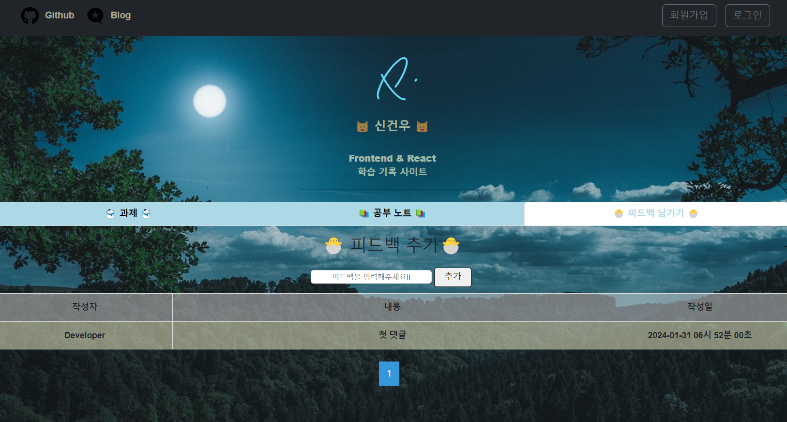
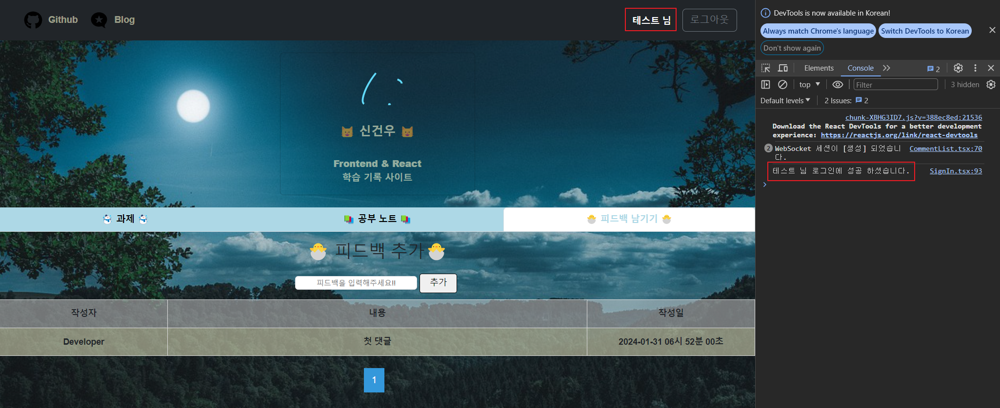
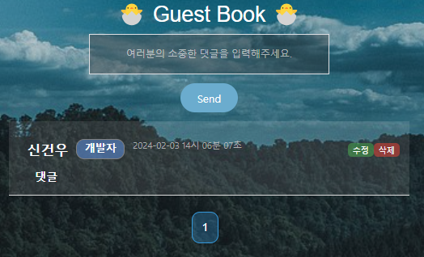
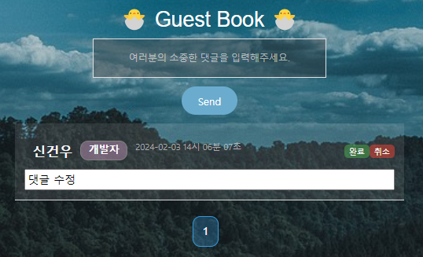
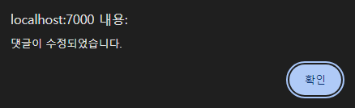
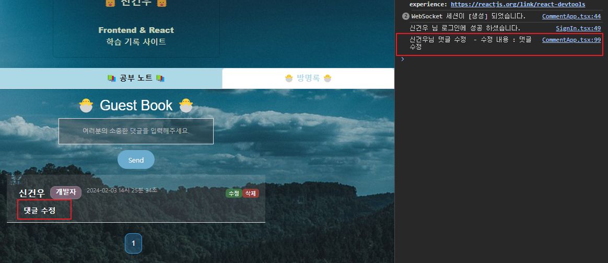
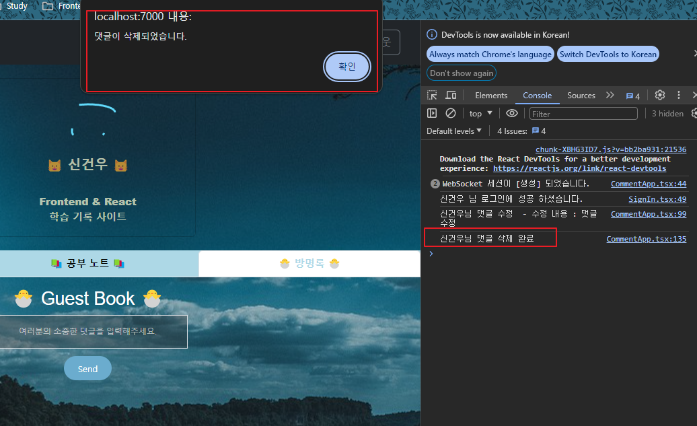
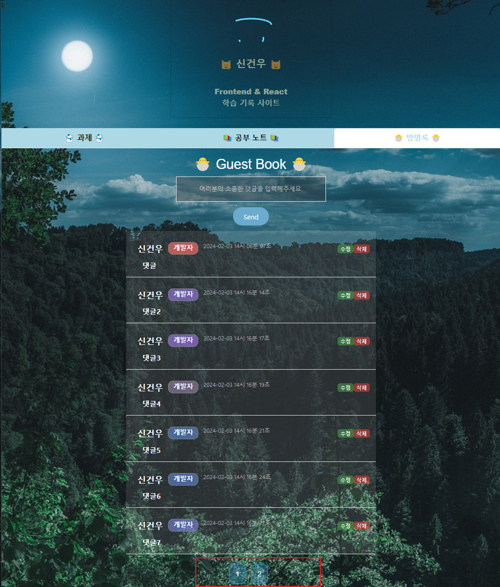
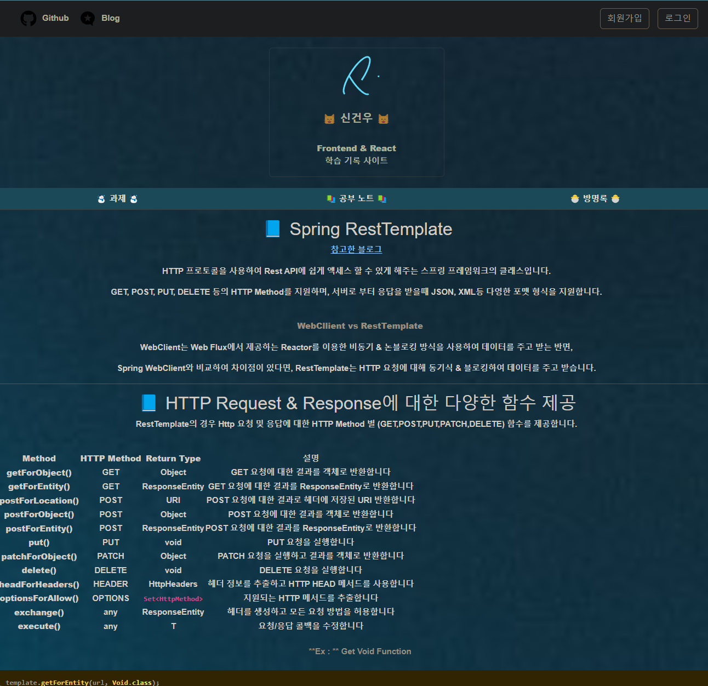

## 📚 Learn Frontend 📚

React & TypeScript / Kotlin 사용해 프론트엔드 학습 기록 사이트 만들기

> **페이지 처음 화면**



---

## 📘 기능

### 추가한 목록

- 회원가입 / 로그인 / 로그아웃 (Spring Security + JWT)
- **댓글** 추가 / 수정 / 삭제 (Web Socket)
- **마크다운** 작성 / 마크다운 Viewer 기능 -> **Markdown 브랜치에 적용되어 있음 (main 브랜치는 아직)**
  - Code Highlighter 적용
  - `<br>` 태그 줄바꿈으로 치환
  - 마크다운 문법 중 `>` blockquate 적용

<br>

### 회원가입 & 로그인 & 로그아웃 기능

- 회원가입 후 비밀번호는 백엔드에서 Bcrypt로 암호화해서 저장
- JWT Authentication Filter의 검증 예외 URL로 지정

<details>
<summary>펼치기</summary>

> **🚩 회원 가입**


<br>

> **🚩 로그인**

- 유저가 로그인 시 백엔드에서 받은 JWT Token을 프론트엔드 단에서 LocalStorage에 들고 있음
- JWT Authentication Filter의 검증 예외 URL




<br>

> **🚩 로그아웃**

- 유저가 로그아웃 시 LocalStorage의 JWT Token 제거


</details>

<br>

### 댓글 기능

- Frontend <-> Backend WebSocket Publish & Subscribe
- WebSocket Endpoint URL : ws
- WebSocket Channel Name : '/comment/list'
- 로그인을 안하면 댓글 남기기 불가능 (Session Storage JWT Token 검증)
- 댓글 달린걸 그냥 보는건 모든 유저(anonymous 포함) 허용 (Spring Security 내부 설정)
- Pagination 추가

<details>
<summary>펼치기</summary>

> **🚩 로그인을 안하고 댓긍 등록 시, Session Storage의 JWT 토큰 검증 불가로 인해 댓글 작성 불가**


<br>

> **🚩 댓글 추가**


<br>

> **🚩 댓글 수정**









<br>

> **🚩 댓글 삭제**



<br>

> **🚩 Pagination 추가**



</details>

<br>

### 마크다운 작성 & 보기 기능

- Code Highlighter 적용
- `<br>` 줄바꿈으로 치환
- 마크다운 문법 중 `>` blockquate 적용

<details>
<summary>펼치기</summary>

> **🚩 작성한 마크다운 글 Viewer**



</details>

---

## 📘 Frontend

- React (nodejs: 20.11.0 / yarn: 1.22.21 / vite )
- TypeScript
- Libraries
  - react-router-dom
  - styled-components
  - react-bootstrap
  - axios
  - webkit
  - @stomp/stompjs
  - react-markdown
  - react-syntax-highlighter
  - rehype-sanitize
  - rehype-raw
  - remark-gfm

---

## 📘 Backend

- Spring Boot 3.2.1 (JDK 17)
- Kotlin
- Spring Data JPA
- Spring Webflux
- Spring Security (6.x.x)
- JWT
- WebSocket
- MariaDB
- Lombok

---

## 📘 서버 세팅 스크립트

- Docker
- OpenJDK 17
- Mariadb (Container)
- NodeJS

```bash
#!/bin/bash

# APT Update & Upgrade
apt -y update & apt -y upgrade

# NodeJS LTS Source
curl -sL https://deb.nodesource.com/setup_20.x | sudo -E bash -

# NodeJS & OpenJDK 17 설치
apt -y install nodejs openjdk-17-jdk

# Docker 설치
apt-get -y install apt-transport-https ca-certificates curl gnupg-agent software-properties-common
curl -fsSL https://download.docker.com/linux/ubuntu/gpg | sudo apt-key add -
add-apt-repository "deb [arch=amd64] https://download.docker.com/linux/ubuntu $(lsb_release -cs) stable"
apt -y update
apt-get -y install docker-ce docker-ce-cli containerd.io
systemctl start docker && sudo systemctl enable docker

# MariaDB Container 실행
docker run -d --privileged --name skw -e MARIADB_ROOT_PASSWORD=1234 -p 5000:3306 mariadb

# 기타 패키지 & 방화벽 설정
apt -y install wget curl firewalld git
npm install -g yarn vite typescript
yarn global add react-bootstrap react-router-dom styled-components axios @types/react-bootstrap @types/react-router-dom

ufw disable
systemctl enable firewalld
firewall-cmd --permanent --add-port=3000/tcp
firewall-cmd --permanent --add-port=5000/tcp
firewall-cmd --permanent --add-service=mysql
firewall-cmd --reload

setenforce 0
```

<br>

> 🚩 **DB & DB User 생성 - DB 컨테이너 내부에서 진행**

```sql
create database skw character set utf8mb4 collate utf8mb4_general_ci;
create user 'skw'@'%' identified by '1234';
grant all privileges on skw.* to 'skw'@'%';
flush privileges;
```